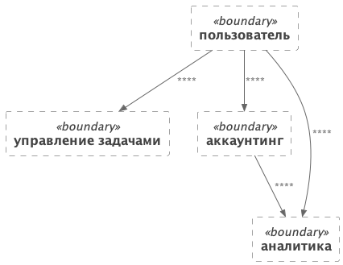
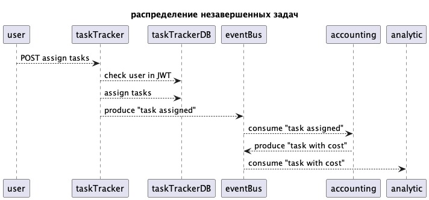
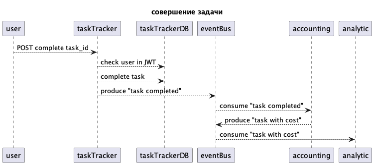
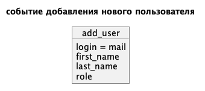
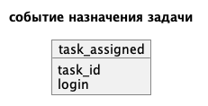

# Описание задачи 

https://lms.tough-dev.school/materials/1cf623e0c65f4123bf6a809b4cd89e12/

# Домены

# Сервисы

# Принципы работы

## Работа с пользователями

## Работа с задачей

## Работа заработанного

## Отправка писем

## События

